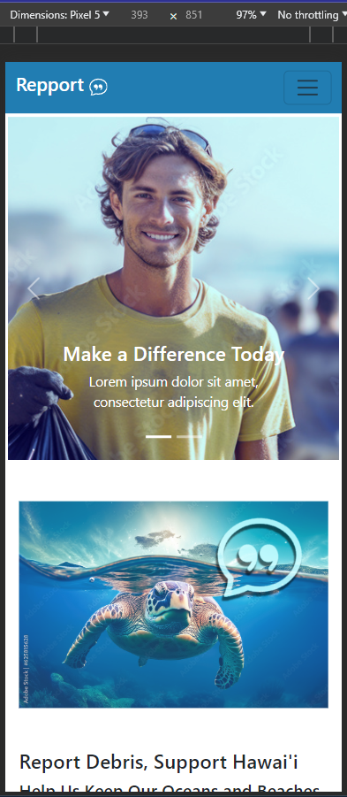
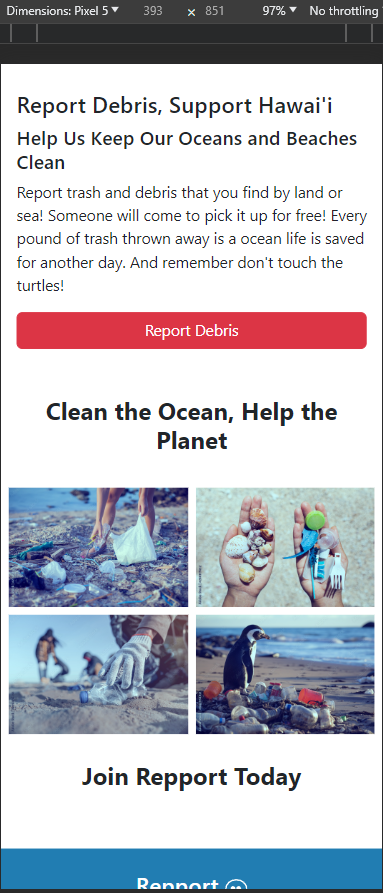
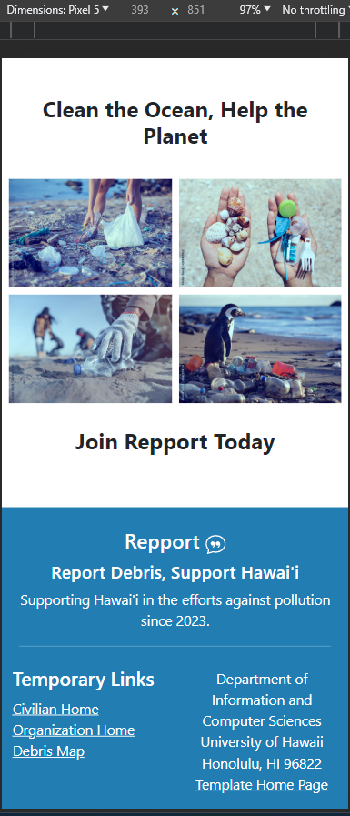

# REPPORT 
### Report Debris, Support Hawai’i!

## About Us
Aloha! We are PHOBS, and we are excited to introduce our innovative solution to address the marine debris problem in Hawai’i. Our REPPORT App is designed to streamline and enhance the communication and coordination among various organizations involved in marine debris removal. We aim to create a centralized database and dispatch system that not only promotes efficient debris removal but also offers a platform for locals to report debris incidents. The ultimate goal of the REPPORT App is to significantly contribute to the preservation of Hawai'i's natural beauty and marine ecosystems.

    
    
    

## Project Goals
The REPPORT App is designed with the following key goals in mind:

1. **Centralized Database:** Create a comprehensive centralized database that serves as the foundation for our system. This database will be accessible to the public in real-time, providing a wealth of valuable information about marine debris management.

2. **Real-time Public Access:** Develop user-friendly features that allow the public to access real-time information about ongoing debris removal efforts, locations, and progress.

3. **Dispatch Communication Tools:** Implement effective communication tools that enable seamless collaboration and coordination among various organizations involved in debris removal. This includes features for instant communication, updates, and task allocation.

4. **Comprehensive Data Capture:** Establish a cradle-to-grave database that captures data at all seven critical steps of marine debris management. This includes detecting debris in the ocean, removal efforts, debris type assessments, and disposal/recycling choices.

5. **Debris Amount and Proportion Reporting:** Enable the database to generate reports on debris amounts and proportions based on mapped locations, over time, and the efficiency of removal efforts. This data will help in assessing the impact of various initiatives.

6. **Debris Type and Polymer Type Tracking:** Implement features that categorize and track debris types and polymer types, helping organizations make informed decisions regarding the most effective removal and disposal methods.

7. **Disposal Mechanism Data:** Collect and analyze data related to the disposal mechanisms used for removed debris, including recycling options. This will promote environmentally responsible practices.

**The REPPORT App seeks to bridge the gap in communication, data collection, and transparency in marine debris management in Hawai'i. By achieving these goals, we aim to empower local communities, organizations, and government agencies to work together efficiently, leading to cleaner oceans and a brighter future for Hawai'i's natural environment.**

Together, let's report debris and support Hawai'i!
