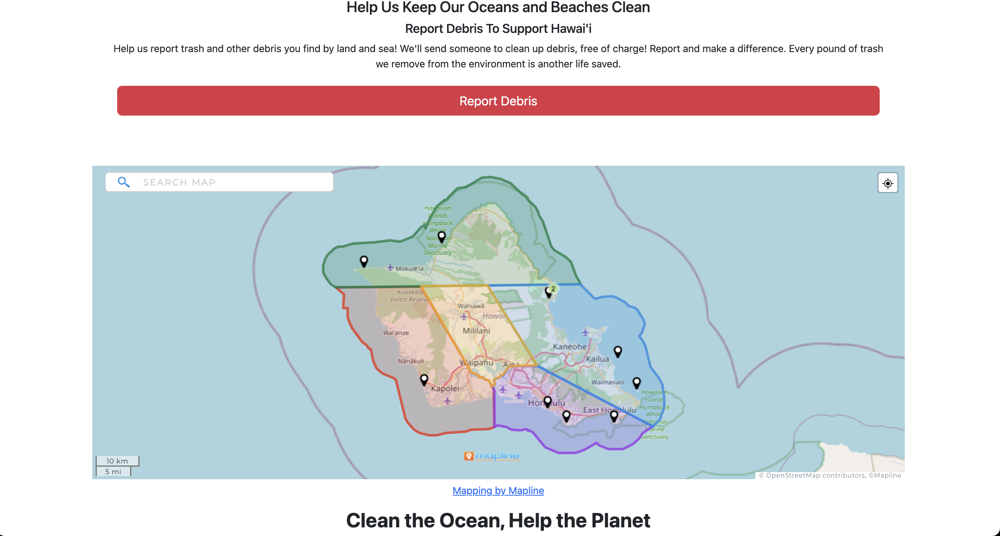

# REPPORT 
[](https://github.com/phobs-co/repport/actions/workflows/ci.yml)

### Report Debris, Support Hawai’i!

# Overview

## Logins for out demo:
To log in to the site, we have two demo users:

1. Civilian login: john@foo.com
2. Organization login: org@foo.com

## About Us
Aloha! We are PHOBS, and we are excited to introduce our innovative solution to address the marine debris problem in Hawai’i. Our REPPORT App is designed to streamline and enhance the communication and coordination among various organizations involved in marine debris removal. We aim to create a centralized database and dispatch system that not only promotes efficient debris removal but also offers a platform for locals to report debris incidents. The ultimate goal of the REPPORT App is to significantly contribute to the preservation of Hawai'i's natural beauty and marine ecosystems.

<div style="display: flex;">
    
    
    
</div>


## Project Goals
The REPPORT App is designed with the following key goals in mind:

1. **Centralized Database:** Create a comprehensive centralized database that serves as the foundation for our system. This database will be accessible to the public in real-time, providing a wealth of valuable information about marine debris management.

2. **Real-time Public Access:** Develop user-friendly features that allow the public to access real-time information about ongoing debris removal efforts, locations, and progress.

3. **Dispatch Communication Tools:** Implement effective communication tools that enable seamless collaboration and coordination among various organizations involved in debris removal. This includes features for instant communication, updates, and task allocation.

4. **Comprehensive Data Capture:** Establish a cradle-to-grave database that captures data at all seven critical steps of marine debris management. This includes detecting debris in the ocean, removal efforts, debris type assessments, and disposal/recycling choices.

5. **Debris Amount and Proportion Reporting:** Enable the database to generate reports on debris amounts and proportions based on mapped locations, over time, and the efficiency of removal efforts. This data will help in assessing the impact of various initiatives.

6. **Debris Type and Polymer Type Tracking:** Implement features that categorize and track debris types and polymer types, helping organizations make informed decisions regarding the most effective removal and disposal methods.

7. **Disposal Mechanism Data:** Collect and analyze data related to the disposal mechanisms used for removed debris, including recycling options. This will promote environmentally responsible practices.

**The REPPORT App seeks to bridge the gap in communication, data collection, and transparency in marine debris management in Hawai'i. By achieving these goals, we aim to empower local communities, organizations, and government agencies to work together efficiently, leading to cleaner oceans and a brighter future for Hawai'i's natural environment.**

Together, let's report debris and support Hawai'i!

## Team contract:
[Team Contract](https://docs.google.com/document/d/1hqwtUSlLyOAMSRyKHdL3C6uYKi89OWbeOxxnrKbckJA/edit?usp=sharing)

## Milestone 1
[Milestone 1](https://github.com/orgs/phobs-co/projects/1)
<div style="display: flex;">
    
    
    
    
</div>

## Milestone 2
[Milestone 2](https://github.com/orgs/phobs-co/projects/2)
<div style="display: flex;">
    
    
    
    
    
</div>

## Milestone 3
[Milestone 3](https://github.com/orgs/phobs-co/projects/3)
<div style="display: flex;">
    
    
</div>

# User Guide

<!-- Maybe we can use the screenshots above? -->

Currently there are a few different ways to utilize the Repport website:
* **Public view:** This allows community members to report found debris without needing an account. 
* **Signed-in view:** Community members can opt to create an account, which facilitates the process of contacting them.
* **Organization user signed-in view:** Participating organizations can view submitted debris reports, monitor changes, and update the status of debris they've collected.

## Using Public View

Anyone can report debris. To do this, navigate to the homepage and click the **"Report Debris"** button, which is readily visible in red. You'll be directed to a form where you can enter information about the debris, such as its type and location. After completing the form, click the **Submit** button to send your report to the participating organizations for review.

The process remains the same if you choose to create a personal account to report debris.

## Account Creation

To make a new account, click on the login dropdown on the top right of the navbar. This allows you to create an account using an email and a password. In the future, you can use these credentials to log into the site.

## Organization View

To view reported debris, organizations must sign in with their organizational login credentials. They can register for the site and create a new user account under their organization's name. The links for registration are available in the footer under **"Organization Sign In"** and **"Organization Sign Up"**.

Upon signing in, organization users can access new navigation bar items:

* Reported
* Claimed
* Stored
* Distributed
* Organization Home

#### Reported

The **Reported** section provides a table listing all newly submitted debris that hasn't been collected yet. This table highlights key information about each debris report and provides two buttons for each entry: **Details** and **Claim**. The **Details** button opens a new page that displays comprehensive information about the debris event and provides options to edit some data. The **Claim** button indicates an organization's intent to collect the debris. Clicking this button transfers the debris report to the "Claimed" section.

#### Claimed

_(to be added)_

#### Stored

_(to be added)_

#### Distributed

_(to be added)_

#### Organization Home

_(to be added)_


<!--Map -->

# Community Feedback

> #### The website is user-friendly with clear navigation cues. Reporting debris is straightforward, offering multiple options. Functionality is effective, and I haven't encountered issues. It lacks information about the people handling debris cleanup; featuring them could enhance transparency and trust. While images seem sourced from the internet, adding real people associated with the organization could enhance credibility.

> #### The website's simplicity aids in easy navigation, efficiently serving its purpose despite its plain design. The debris reporting section is functional, allowing users to specify the location and type of debris, with a focus on smaller items often left by beachgoers. It's likely that users will predominantly report minor litter issues, such as trash left by beach visitors. There's a potential for users to utilize the platform to draw attention to irresponsible behavior, like families neglecting to clean up after themselves, creating a sense of accountability. While the website's primary function is practical, it also serves as a means for users to encourage responsible behavior through reporting.

> #### This app could be more comprehensive by including everyday trash generated by people, a prevalent issue in popular Hawaiian beaches where individuals often neglect to clean up after themselves. This addition could generate more activity on the website. Collaboration with existing organizations actively cleaning beaches on-site could be beneficial to ensure efficient and timely cleanup. Moreover, organizing the links to these collaborating organizations as part of the user's profile sign-in, rather than placing them at the bottom of the homepage, would offer more visibility and ease of access, fostering a stronger connection between users and these cleanup efforts.

> #### The website looks cool, and with a bit of explanation, I understand the concept. However, there's a flood of similar reports, and it might be repetitive. Also, there could be issues with elderly users who might struggle with the website or app. I suggest adding a phone number for reporting debris. Having the website open 24/7, waiting for reports, might not be efficient.

> #### The homepage is good, but the paragraph near the turtle picture needs some wording adjustments. The moving pictures could be improved by adding more arrows for better navigation. There seems to be a glitch where the arrows only appear after clicking a direction. The links to each page are okay, but the wording for each page could be clearer. For instance, instead of "Claimed, stored, and distributed," use terms like "Pending, pickup, and collected" for easier understanding by visitors navigating the site independently.


# Developer Guide
This guide will lead you through the process of downloading, installing, running, and modifying the system for our GitHub public repository.

## Downloading The Repository
1. Start by navigating to the repository on the GitHub website.
2. Click on the green 'Code' button near the top right of the repository page.
3. To clone the repository using HTTPS, under "Clone with HTTPS", click the clipboard.
4. Open Terminal.
5. Change the current working directory to the location where you want the cloned directory.
6. Type `git clone`, and then paste the URL you copied earlier.
```bash
$ git clone https://github.com/phobs-co/repport
```

## Application Structure: Meteor.js (MongoDB & JSX) Application 

1. **Meteor Setup**: Meteor is installed globally on your machine. You initialize a new Meteor project using the CLI command `meteor create <app-name>`. This sets up the basic structure of your project, including Meteor, Node.js, and MongoDB.

2. **Project Structure**: A typical Meteor project has three main directories: `/client` (frontend code), and `/server` (backend code)

3. **Database (MongoDB)**: MongoDB, Meteor's default database, automatically sets up during project initialization. Collections, set up in the `/both` section, can be observed by both server and client.

4. **JSX**: With the `react-meteor-data` package, Meteor supports JSX right out of the box. You can write your components using JSX in the `/client` folder.

5. **Client**: This includes `main.html`, `main.js`, and `main.css` files for HTML, JS, and CSS respectively. Here, you use Meteor's `react-meteor-data` package to create React components.

6. **Server**: Also contains a `main.js` file, which is the server's entry point. Here, you can publish your MongoDB collections to the client and setup server-side methods.

7. **Data Loading**: Meteor's data on the wire approach delivers data to the client as needed, via 'publications' (server side) and 'subscriptions' (client side).

8. **Real-Time Updates**: With its Distributed Data Protocol (DDP), Meteor provides real-time updates between the server (database changes) and client. It has a built-in pub-sub model for easy setup.

9. **Building & Running**: You can start your app using `meteor`, which also sets up hot code push and watches for source file changes. On building, Meteor bundles up your JavaScript, CSS, and HTML into minified JavaScript and starts a Node.js server.


## Template
This app was started with the help of a template from the University of Hawaii ICS department. If you would like to look at this template, it can be found here: http://ics-software-engineering.github.io/meteor-application-template-react/
